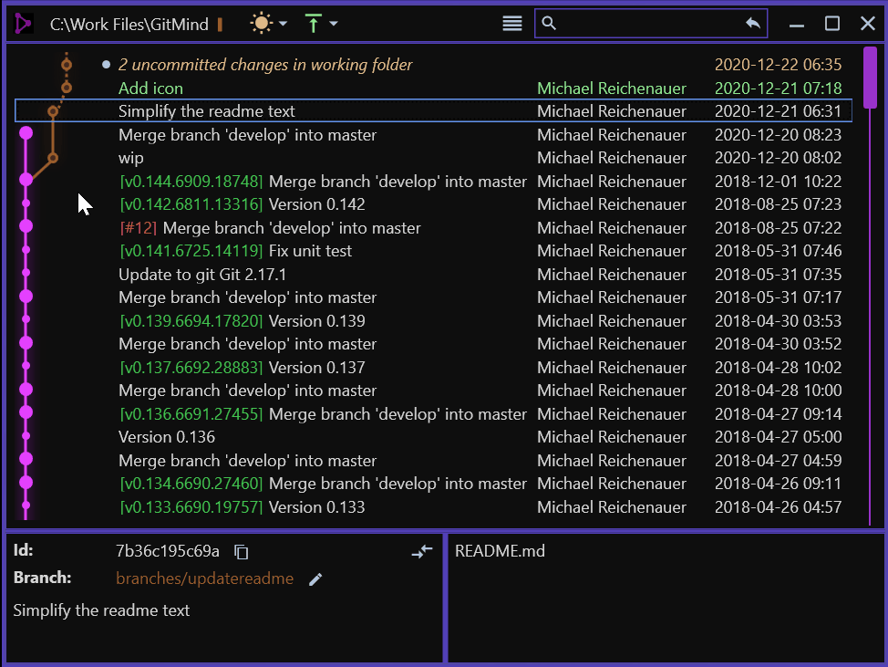

#  GitMind  
GitMind is a Windows GUI Git client, which makes it easier to use Git, especially when using a branch model similar to e.g. GitFlow. GitMind visualizes the branch structure more like one imagines the branches, instead of just showing branches exactly as the Git raw data specifies. GitMind makes it easy to toggle which branches to show and hide, and simplifies using the most common git commands.

  

## Background
Usually Git clients visualize the repository as an overwhelming number of branches, which makes the commits history difficult to understand. As a workaround, many developers simplify git history by rebasing or squashing.

Some clients try to reduce the branch complexity by hiding commits. A better approach is to make it possible to toggle which branches to show and which branches to hide. Thus a user can focus on tracking branches that really matters to them. For a developer, it might be to track just the main branch and the current working branch and for a team leader, it might be tracking main and a few selected features branches.

GitMind provides an user experience, where the visualization of branches and commits history is understandable and usable without the need for rebasing or squashing. GitMind also simplifies usage of the most common commands by providing context menus and simplified dialogs.

## Download
* [Windows](https://github.com/michael-reichenauer/GitMind/releases) 